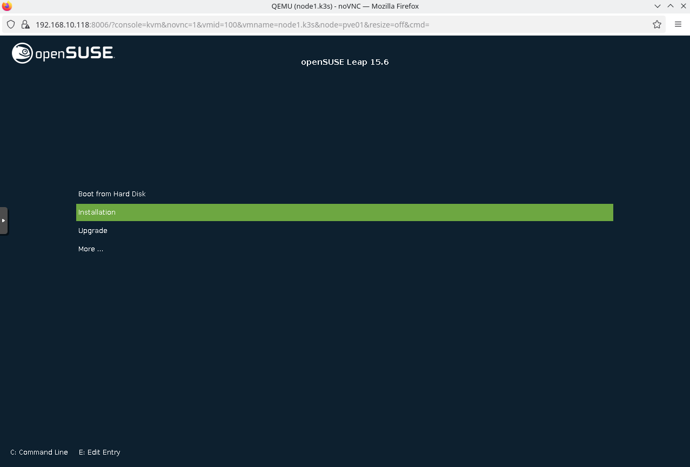
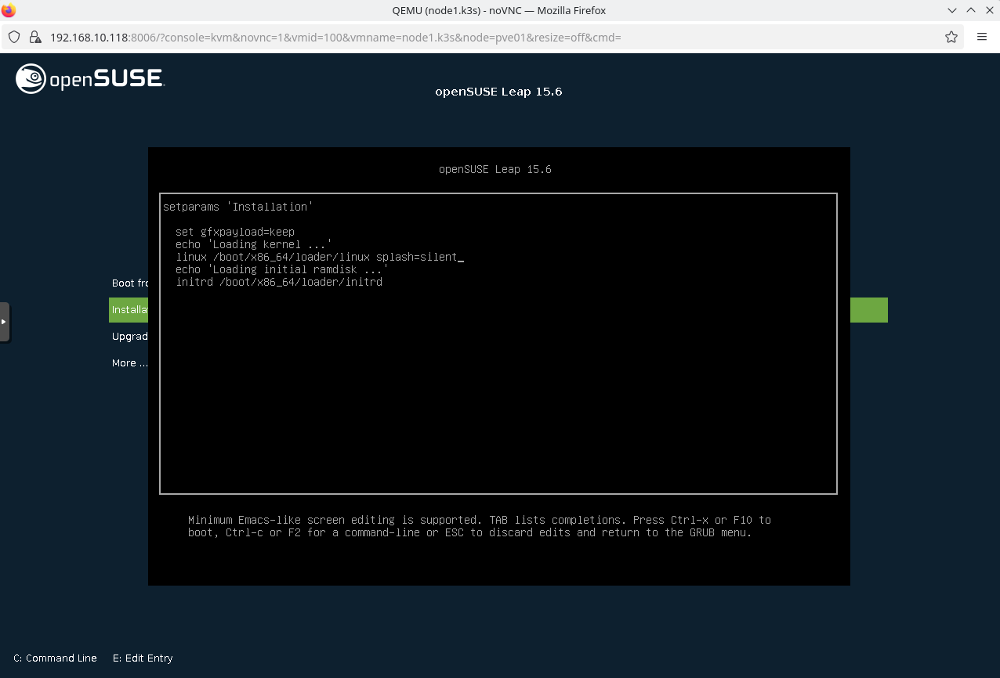
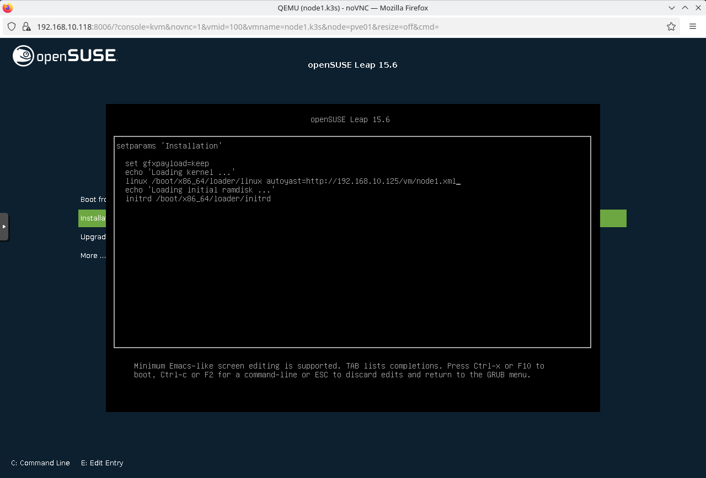

## AutoYast

To avoid the ancient ritual of clicking "Next" a thousand times, I summoned the great [AutoYaST](https://doc.opensuse.org/documentation/leap/autoyast/single-html/book-autoyast/index.html) to preordain the fate of my nodes. With one sacred XML file, I scripted the full metal resurrection of each machine — disks partitioned with surgical precision, packages hand-picked like artisanal cheese, and system settings carved in stone before the OS even had a chance to ask questions. The installer didn't just boot, it *complied*, silently crafting perfect little minions without bothering me for a single keyboard stroke. Automation is beautiful when it obeys. (I detail this in the autoyast folder)

By the time the first boot was done, my nodes emerged like trained warhorses at the ready - configured, networked, SSH-ready, and morally prepared for the burden of running Kubernetes. No extra tinkering, no post-install patch-fu, no "oops I forgot to install curl" drama. Just pure, industrial-grade repeatability. Honestly, if your infra doesn't greet you with "Sir, I'm ready to sync with FluxCD and stuff" on first boot, are you even doing your job right?

### Identity of the Node

```xml
<hostname>node1</hostname>

<ipaddr>192.168.69.20</ipaddr>
<netmask>255.255.255.0</netmask>
<network>192.168.69.0</network>
<prefixlen>24</prefixlen>

<nameserver>192.168.69.254</nameserver>

<gateway>192.168.69.254</gateway>
```

The node is christened node1, with a noble IP of 192.168.69.20 and all related network settings, like netmask, gateway, etc. You'll want to change both if you're casting this spell on multiple machines — unless you're going for a "fight club cluster" where all nodes share the same name and IP (spoiler: don't). The DNS nameserver and gateway are set to 192.168.69.254, so unless your network speaks the same incantation, update these accordingly.

### Disk Magic and Partition Runes

```xml
<device>/dev/vda</device>
```

This profile assumes you’re booting from /dev/vda (virtio disk, commonly used in VMs). If you’re deploying on physical metal or using different devices (like /dev/sda or NVMe /dev/nvme0n1), update the device paths, or AutoYaST will just stare blankly into the void and reboot repeatedly.

Partitioning is gloriously specific—each mount point has its own logical volume. You’ll find:

    / — the root, because obviously

    /var/lib/rancher — prepped for K3s or RKE2 shenanigans

    /var/lib/longhorn — for when you summon distributed storage demons

    /tmp, /var/tmp, /usr, /home — all separated for containment and arcane security rituals

⚠️ You’ll likely need to adjust the disk sizes (<size>) depending on your available storage. The "max" value is used cleverly for Longhorn, because block storage demands sacrifices.

### Software Arsenal

```xml
<package>helm</package>
<package>mc</package>
<package>htop</package>
<package>open-iscsi</package>
<package>which</package>
```

This loadout includes the essential tools of any system sorcerer: helm, mc, htop, and even which (for those who don’t know where they’ve hidden their own binaries, not part of the default minimal installation). You may want to add packages like git, curl, gnupg, or even the mighty k3s binary itself—unless you’re planning to summon it over the network later (as you should). Feel free to change the list.

### Services and Daemons

```xml
<disable><service>firewalld</service></disable>
<enable><service>sshd</service></enable>
```

You’ll notice we slay firewalld right away, because in a homelab, the real firewall is a router under your desk (also I have static nftables rules...). SSH is enabled for remote wizardry, and chronyd syncs time so your certificates don’t mysteriously expire five seconds after boot. Again, tune this list if your rituals require other daemons.

### Secrets and Security

```xml
<username>root</username>
<user_password>changeit</user_password>
<encrypted>false</encrypted>
```

Let’s not pretend this isn’t sketchy. The root password is in plain text and set to changeit, which is security code for "please breach me immediately." You must change this before sharing, syncing, or pushing this file anywhere outside your batcave. Better yet, encrypt the password and set encrypted=true.


### What You Should Modify For Your Own Nodes

| 🔮 Element      | Why You Care                         | Change It To...                        |
| --------------- | ------------------------------------ | -------------------------------------- |
| `hostname`      | Unique identity per node             | `node2`, `node3`, etc.                 |
| `ipaddr`        | Static IP per machine                | According to your own network plan     |
| `/dev/vda`      | Disk device path                     | `/dev/sda`, `/dev/nvme0n1`, etc.       |
| Partition sizes | Your disk probably isn’t *just* 40GB | Increase depending on workload/storage |
| `user_password` | Default root password, in plain text | At least encrypt it!                   |
| Repos/URLs      | openSUSE Leap 15.6 default           | Check mirror speed / custom repos      |


### Final Words of Wizardry

This AutoYaST profile is your golden scroll: repeatable, reliable, and terrifyingly powerful. With it, you can boot metal into ready-to-work linux nodes faster than most people find their terminal icon. Just remember: tweak before you cast. Unless you like wiping disks and debugging network configs at 3am while whispering “it worked on the last node…”


## Neat! But... how to use it?

To begin the ritual, you’ll need to summon the openSUSE Leap 15.6 installation ISO from https://get.opensuse.org/leap/15.6/ (as of writing these lines... may there is a newer version, when you read this)  
Use the Network Image if you prefer minimal boot clutter and faster downloads. Burn it to a USB stick or mount it as a virtual CD in your favorite hypervisor (KVM, VirtualBox, Proxmox — pick your poison). Boot your machine or VM with the ISO, and prepare to feed it the AutoYaST file like a config-hungry beast. Also, you need a web server, to host the xml file.



Press the "I know this better"... I mean "e" button, to edit the boot kernel paramters, you shold see something similar.



Add "autoyast=http://yourwebserver/path/to/node1.xml"



Press Ctrl+x to boot and pray.
